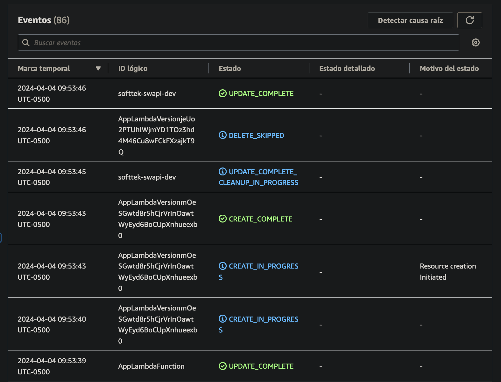

# Softtek Traduce SWAPI y Starwars CRUD App

### Configuración inicial - Comandos a ejecutar

Clonar el repositorio para empezar a utilizar la aplicación. Hay que tener instalado [Nodejs](https://nodejs.org/en) y [Serverless](https://www.npmjs.com/package/serverless) de manera global si se quiere probar en local:

```
npm install -g serverless
```

Una vez completada la instalación ingresar a la carpeta y ejecutar el comando:

```
npm install
```

##### El package.json del proyecto cuenta con los siguientes comandos:

1. Comando para compilar generar el build de la aplicación en /dist y correr la aplicación de manera local con serverless:
   ```
   npm start
   ```
2. Comando para correr en desarrollo, recompila al guardar cambios en tiempo real:
   ```
   npm run dev
   ```
3. Comando para ejecutar las pruebas unitarias de la aplicación en un entorno local:
   ```
   npm test
   ```
4. Comando para desplegar la aplicación en un AWS (Se requiere configuración previa del CLI de serverless):
   ```
   sls deploy
   ```
   Antes de ejecutar el `sls deploy` hay que crear el archivo `.env` en la raiz del proyecto.

```
ACCESS_KEY=${Tu Llave de Acceso}
SECRET_KEY=${Tu Clave Secreta}
```

### Documentación Postman

https://documenter.getpostman.com/view/3273833/2s9YR6atkQ

---

### Documentación Swagger

https://47hntlg2v4.execute-api.us-east-1.amazonaws.com/api

---

### Pruebas en desarrollo


---

### Despliegue en AWS



#### Endpoints:

Obtiene todas los personajes de SWAPI y los traduce:

##### GET: https://47hntlg2v4.execute-api.us-east-1.amazonaws.com/swapi

Obtiene un personaje de SWAPI y lo traduce:

##### GET: https://47hntlg2v4.execute-api.us-east-1.amazonaws.com/swapi/:id

Obtiene un personaje de SWAPI y lo traduce. Luego lo crea en la BD:

##### POST: https://47hntlg2v4.execute-api.us-east-1.amazonaws.com/swapi/:id

---

Crea un personaje de Starwars:

##### POST: https://47hntlg2v4.execute-api.us-east-1.amazonaws.com/personas

Obtiene los personajes de Starwars:

##### GET: https://47hntlg2v4.execute-api.us-east-1.amazonaws.com/personas

Obtiene un personaje de Starwars:

##### GET: https://47hntlg2v4.execute-api.us-east-1.amazonaws.com/personas/:id

Actualiza un personaje de Starwars:

##### PATCH: https://47hntlg2v4.execute-api.us-east-1.amazonaws.com/personas/:id

Borra un personaje de Starwars:

##### DELETE: https://47hntlg2v4.execute-api.us-east-1.amazonaws.com/personas/:id

#### Lambda:

     app: softtek-swapi-dev-app (34 MB)
